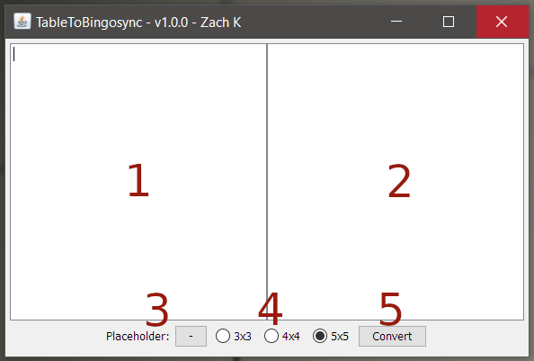
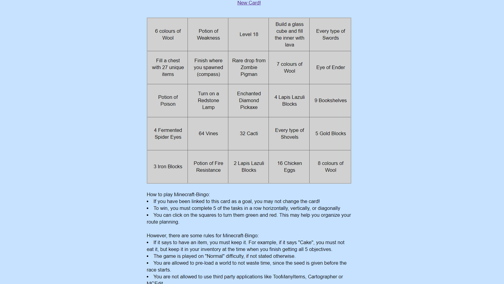

# Table To Bingosync
TableToBingosync is a tool for turning ordinary tables into [Bingosync](https://bingosync.com/) boards quickly and easily. The code and the program are overdocumented for their size, but hopefully it helps you get an understanding of the program for use or modification.

## GUI:
The GUI of Bingosync was created to be simple and straightforward. Here is an image of the program and its components: 
 
1. This is the input pane in which you paste the table you want to convert into Bingosync JSON format. Commas and one or more tabs are interpreted as box (or column) separators, and line breaks and semi-colons are interpreted as row separators. This means that spaces can be included in each entry.
2. This is the output pane in which your converted text will appear in JSON format. You can modify or copy the contents of this pane at anytime, but pressing the "Convert" button again will overrite your work. When you are ready, you can use the text to create a custom board on Bingosync's website.
3. This is the character that will be used to replace empty entries in the output table. To change the character, click on the button and press a key on your keyboard. If you do not want any character as a placeholder, press space.
4. These are the radio buttons that allow you to choose the size of your board; the default size is 5x5. Entries that are not used in the final table will be replaced with the placeholder character.
5. When you are ready to convert the text in the input pane into the output pane, this is the button that you need to press. Text will show up in the output pane that you can edit, copy, and paste into Bingosync.

## Steps:
To copy a table into Bingosync, follow these steps: 
1. Select your entire table and copy and paste it into the input pane (left).
2. Select the size of the board you want and the placeholder character.
3. Press convert. The result should so up in the output pane.
4. Go to [Bingosync](https://bingosync.com) and create a new bingo room. After you set up the name, password, and your nickname, select the game "Custom (Advanced)" and paste the entire JSON text from the output pane into the "Board" field on Bingosync.
5. Set up other settings on Bingosync and then click "Make Room". If everything goes well, you should see the table you originally put into the program on the website!

### Gif
Here is a gif showing all of these steps with a table from engin33r's [Minecraft Bingo](http://engin33r.net/bingo): 

 
 This work is licensed under a <a rel="license" href="http://creativecommons.org/licenses/by/4.0/">Creative Commons Attribution 4.0 International License</a>.